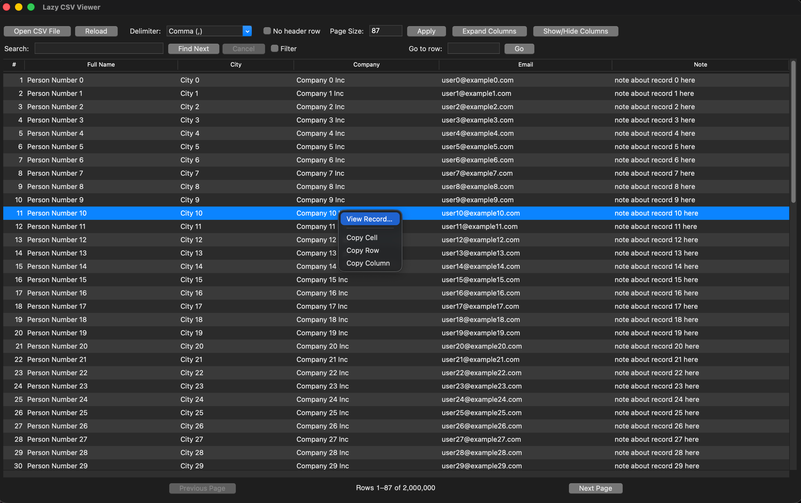

# Lazy CSV Viewer


Open **huge** CSV files in a fraction of a second. Lazy CSV Viewer reads only the
page you're viewing, so multi-gigabyte files open instantly — with search, filter,
jump-to-row, and a full-record detail view on top. Built with Python and Tkinter
for macOS and Windows.



## Features

- **Page-by-page loading**: Open huge CSV files in a fraction of a second — only the current page is read, and Next/Previous seek directly to each page
- **Row count**: Shows `Rows A–B of N`, using a bounded sample estimate (`~N`) that is refined to the exact total in the background
- **Search**: File-wide "Find Next" with wrap-around; runs in the background and can be cancelled
- **Filter**: Show only rows matching a query, paged across the whole file
- **Go to row**: Jump straight to any row number
- **Detail view**: Double-click a row to see the full record (every field, untruncated, including hidden columns)
- **Flexible delimiter support**: Auto-detected on open; comma, tab, semicolon, pipe, or space
- **Encoding-aware**: Detects UTF-8 (incl. BOM), Windows-1252, and Latin-1 so non-UTF-8 files open without errors
- **No-header mode**: Treat the first row as data and auto-name the columns
- **Customizable page size**: Adjust how many rows to load at once
- **Column management**: Show/hide columns, auto-fit to content, or expand to full width; a left row-number column
- **Copy**: Right-click to copy a cell, row, or column
- **Recent files & persistence**: Remembers window size, page size, delimiter, and recently opened files
- **Dark mode (macOS)**: Matches the system appearance and re-themes live when you toggle it; Windows uses the light theme
- **Improved readability**: Alternating row colors for easier reading

## Installation

### Option 1: Homebrew (macOS)

```
brew install --cask rudra370/tap/lazy-csv-viewer && xattr -dr com.apple.quarantine "/Applications/Lazy CSV Viewer.app"
```

The app is unsigned, so the command also clears the Gatekeeper quarantine — just
copy-paste the whole line. (Or, instead of `xattr`, open it once via System
Settings → Privacy & Security → **Open Anyway**.)

### Option 2: Download a prebuilt app

Grab the latest macOS `.app` or Windows `.exe` from the
[Releases](https://github.com/Rudra370/lazy_csv_viewer/releases) page and unzip it.
On macOS the `.app` is unsigned, so clear its quarantine flag the same way (point
the command at wherever you unzipped it):

```
xattr -dr com.apple.quarantine "Lazy CSV Viewer.app"
```

### Option 3: Run from source

1. Ensure you have Python 3.7+ installed
2. Clone this repository:
   ```
   git clone https://github.com/Rudra370/lazy_csv_viewer
   cd lazy_csv_viewer
   ```
3. Run the application:
   ```
   python3 main.py
   ```

### Option 4: Build a standalone macOS app

Build a double-clickable `.app` bundle (generates an icon and runs PyInstaller).
On Homebrew Python the system `pip` is locked down, so install tools into a
virtualenv first:

```
python3 -m venv .venv
source .venv/bin/activate
pip install pyinstaller
./build.sh
```

The bundle is created at `dist/Lazy CSV Viewer.app` — launch it with
`open "dist/Lazy CSV Viewer.app"`. On other platforms, PyInstaller still works;
run it directly (`python -m PyInstaller --windowed main.py`).

## Usage

1. Click **Open CSV File** (or `Cmd/Ctrl+O`) and pick a file — the delimiter and
   encoding are detected automatically.
2. Page through with **Previous / Next** (or `Cmd/Ctrl+←/→`); the indicator shows
   `Rows A–B of N`.
3. **Search** any text with Find Next (`Cmd/Ctrl+F`), or tick **Filter** to show
   only matching rows. **Go to row** jumps straight to a row number.
4. **Double-click a row** to open its full record — every field, untruncated,
   including hidden columns.
5. **Right-click** a cell to copy the cell, row, or column.
6. Tune the view: page size, **Expand / Collapse Columns**, **Show/Hide Columns**,
   and **No header row** for headerless files. Window size, page size, delimiter,
   and recent files are remembered between launches.

### Keyboard Shortcuts

- `Left Arrow` / `Right Arrow`: Scroll left / right
- `Shift + Left/Right Arrow`: Scroll faster
- `Shift + Mouse Wheel`: Horizontal scrolling
- `Cmd/Ctrl + Left/Right Arrow`: Previous / Next page
- `Cmd/Ctrl + F`: Focus the search box
- `Cmd/Ctrl + O`: Open a file
- `Enter` in the search box: Find next match

## Development

The tests require `tkinter` and a display. On Homebrew Python the system `pip`
is externally managed, so use a virtualenv (it inherits `tkinter` from the base
install):

```
python3 -m venv .venv
source .venv/bin/activate
pip install pytest
python -m pytest
```

## Requirements

Only needed to run from source or build — the Homebrew and prebuilt apps bundle everything:

- Python 3.7+
- Tkinter (bundled with most Python installs; on Homebrew Python: `brew install python-tk`)

## License

[MIT License](LICENSE)

## Contributing

Contributions are welcome! Feel free to submit a Pull Request.
